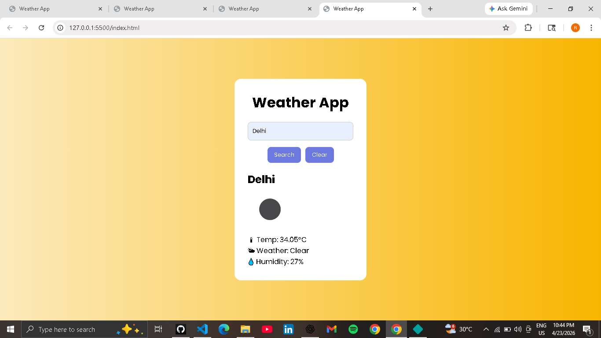
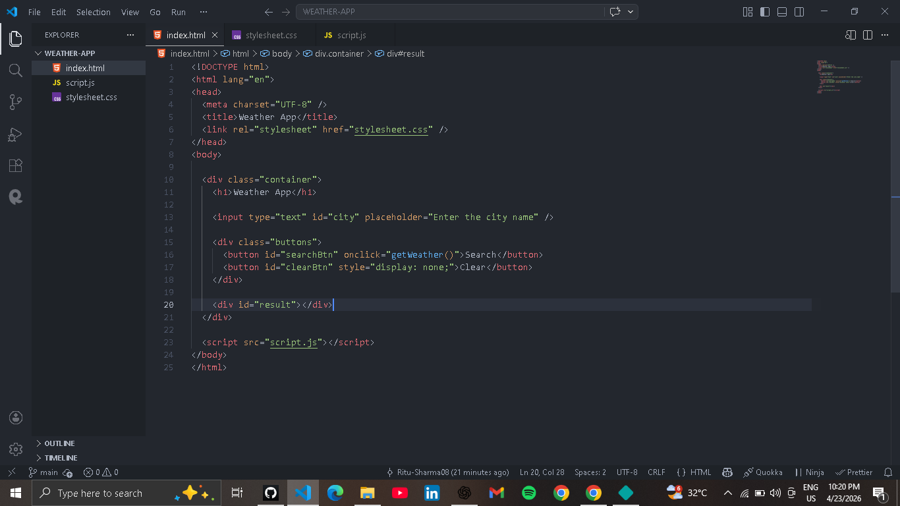
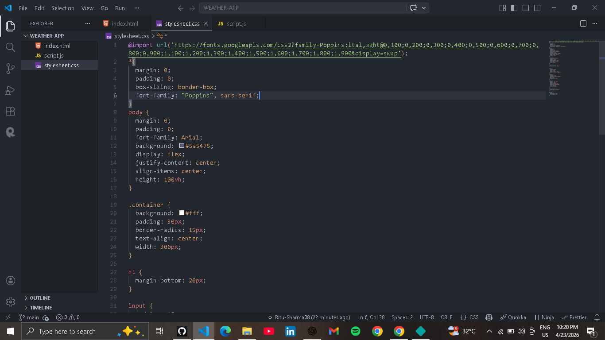
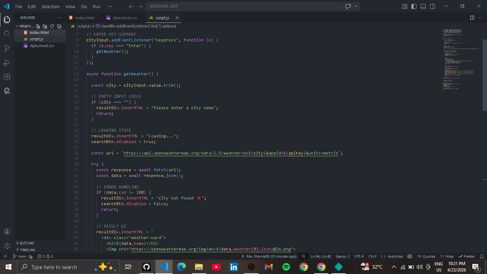
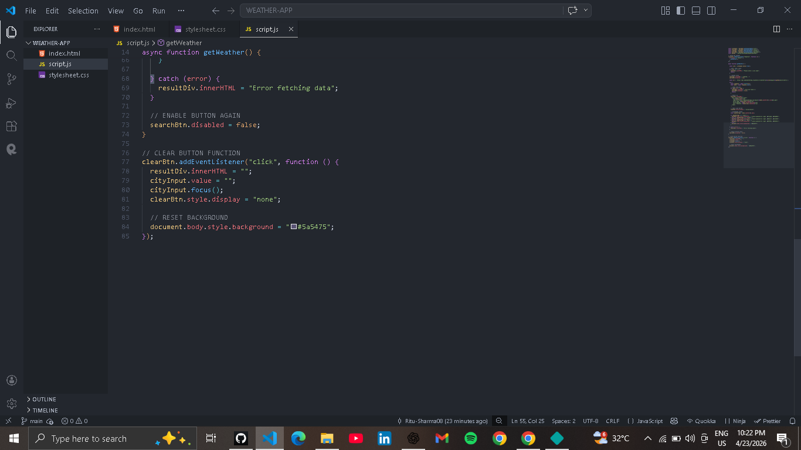

# 🌦️ Weather App

A simple and responsive Weather App built using HTML, CSS, and JavaScript.  
It fetches real-time weather data using OpenWeatherMap API.

---

## 🚀 Features

- Search weather by city name
- Real-time temperature display
- Weather condition (Clear, Clouds, Rain, etc.)
- Humidity information
- Dynamic background change
- Loading state & error handling
- Clear button to reset data

---

## 🛠️ Tech Stack

- HTML
- CSS
- JavaScript
- OpenWeatherMap API

---

## 🔗 Live Demo

https://ritusharma-weather-tracking-app.netlify.app/

---

---

## ⚠️ Note

This project uses OpenWeatherMap API.  
You need your own API key to run it locally.

---
## Live Preview

---

## 📸 Screenshot 

## 1. HTML Structure 

## 2. CSS Styling

## 3. JavaScript Logic

## 4. API Integration

---

## 🙋‍♀️ Author

Ritu Sharma

